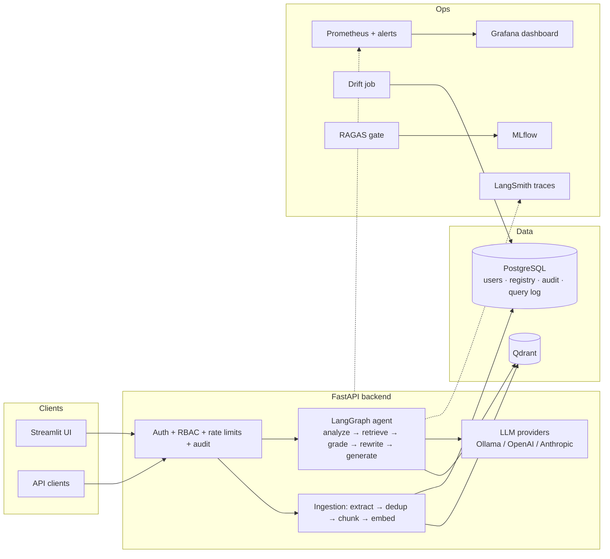

# Enterprise-Grade Agentic RAG Platform

> A production-grade platform for **agentic RAG, fine-tuning, and MLOps** — designed and built end-to-end: system design, secure backend, observability, evaluation gates, drift detection, and cloud deployment. Built to demonstrate Lead GenAI Engineer (Systems Engineer) capabilities.

**Status:** ✅ v1.0 — all phases implemented (see [PLAN.md](PLAN.md) for the phase map and what to study/extend in each).

## What it does

Authenticated users upload documents and ask questions answered **only** from those documents, with citations — wrapped in the full operational loop a real enterprise deployment needs.

| Capability | Implementation |
|---|---|
| Agentic RAG (LangGraph) | analyze → route → retrieve → grade → rewrite → generate, with conversation memory |
| Query analysis | Spell/ambiguity correction before retrieval; small-talk routing; superlative-intent detection (ADR-009) |
| Structural retrieval | `phase_number` metadata + Qdrant range index: "what's the final phase?" ranks by structure, not text similarity |
| Multi-provider LLMs | Ollama (local) / OpenAI / Anthropic — switchable per request |
| Hybrid-ready search | Dense (default) or dense+BM25 fusion via `RETRIEVAL_MODE=hybrid` |
| Secure backend | JWT + 3-role RBAC, rate limiting, audit trail, user management, account disable |
| Ingestion | txt/md/pdf/docx/html, chunking, content-hash dedup, document registry |
| Observability | LangSmith traces + custom Prometheus metrics + provisioned Grafana dashboard + alert rules |
| Self-hosted LLM tracing | OpenTelemetry: OpenInference→Phoenix or OpenLLMetry→Jaeger via `TRACING_BACKEND` (ADR-011) |
| Evaluation (LLMOps) | RAGAS harness → MLflow tracking → CI quality gate with thresholds |
| Fine-tuning (MLOps) | QLoRA train → merge → GGUF → serve via Ollama through the same API |
| Drift detection | Production query log → weekly embedding-drift job → runbook |
| Eval program | Stack map + taxonomy, gold benchmarks, calibrated LLM-judge, cost/token/node-latency accounting, baseline scorecard, model×strategy matrix, Pareto frontier ([docs/04](docs/04-eval-program.md), [evals/](evals/README.md)) |
| Production deploy | Caddy TLS compose, GHCR CD pipeline, Azure/GCP guides |

## Stack

**LangGraph** (agents) · **Qdrant** (vectors) · **LangSmith** (LLM observability) · **FastAPI** (backend) · **Docker Compose** (deployment) · PostgreSQL · FastEmbed · Prometheus + Grafana · MLflow · RAGAS · Streamlit

## Architecture



Design docs: [architecture](docs/01-architecture.md) · [ADRs](docs/02-adr.md) · [phase plan](PLAN.md) · [eval program](docs/04-eval-program.md)

## Quickstart (dev)

Prerequisites: Docker Desktop. Optional: [Ollama](https://ollama.com) on the host (`ollama pull llama3.1:8b`) for free local inference.

```bash
cp .env.example .env          # then edit secrets
docker compose up -d --build  # api + qdrant + postgres
```

### Run everything (all dashboards)

Windows: double-click **`start-all.bat`** (starts all profiles + opens every dashboard). Or manually:

```bash
docker compose --profile monitoring --profile mlops --profile ui --profile tracing up -d --build
```

| Service | URL | Purpose |
|---|---|---|
| API docs (Swagger) | http://localhost:8000/docs | try every endpoint interactively |
| Streamlit chat UI | http://localhost:8501 | chat interface with sources & analysis |
| Grafana | http://localhost:3000 | dashboards & performance (admin / admin) |
| Prometheus | http://localhost:9090 | metrics time-series + alert rules |
| Qdrant dashboard | http://localhost:6333/dashboard | inspect vectors & collections |
| MLflow | http://localhost:5000 | fine-tuning experiments & model tracking |
| Phoenix (profile: tracing) | http://localhost:6006 | self-hosted LLM traces (`TRACING_BACKEND=phoenix`) |
| Jaeger (profile: tracing) | http://localhost:16686 | OTLP traces via OpenLLMetry (`TRACING_BACKEND=traceloop`) |

Stop everything: `stop-all.bat` (volumes/data are preserved). Core-only startup: `docker compose up -d --build`.

### 60-second tour

```bash
TOKEN=$(curl -s -X POST http://localhost:8000/api/v1/auth/token \
  -d "username=admin@example.com&password=admin123" | python -c "import sys,json;print(json.load(sys.stdin)['access_token'])")

python scripts/ingest_samples.py    # or POST /api/v1/ingest per file

curl -X POST http://localhost:8000/api/v1/chat \
  -H "Authorization: Bearer $TOKEN" -H "Content-Type: application/json" \
  -d '{"question": "What is the best fase to run the final?"}'
```

That last question is deliberately misspelled and structural — the response shows the analyzer's correction (`analysis.was_corrected`, rewrite flag ≥ 1), phase-ranked sources (`retrieval: "phase_rank"`), and full token/cost accounting (`usage`). Send the returned `conversation_id` back to continue with memory; vary strategy per request with `grading` / `max_rewrites` / `top_k`.

Key endpoints: `/auth/token` `/auth/me` `/auth/change-password` `/ingest` `/documents` `/chat` `/admin/users` `/admin/audit` (Swagger has all schemas).

## Production

```bash
# Single VM with automatic HTTPS (Caddy):
DOMAIN=rag.example.com POSTGRES_PASSWORD=... GRAFANA_PASSWORD=... \
  docker compose -f docker-compose.prod.yml up -d --build
```

Managed cloud instead: follow [infra/azure.md](infra/azure.md) or [infra/gcp.md](infra/gcp.md). Release flow: `git tag v1.0.0 && git push --tags` → CD builds GHCR images (+ optional cloud deploy). CI runs lint + tests + eval-metric regression on every push; the full quality gate runs weekly and on demand (`eval.yml`).

## Development

```bash
cd services/api
pip install -r requirements.txt -r requirements-dev.txt
uvicorn app.main:app --reload      # needs: docker compose up -d qdrant postgres
pytest tests -q && ruff check .
```

MLOps workflows: [evals/](evals/README.md) (eval program) · [ml/evaluation](ml/evaluation/README.md) (RAGAS gates) · [ml/finetuning](ml/finetuning/README.md) (QLoRA → Ollama) · [ml/drift](ml/drift/README.md) (drift job + runbook)

## Repository layout

```
├── PLAN.md / docs/            # phase map, architecture, ADRs, eval program
├── docker-compose.yml         # dev stack + profiles
├── docker-compose.prod.yml    # production: Caddy TLS, hardened
├── deploy/Caddyfile           # reverse proxy + auto-HTTPS
├── infra/                     # Azure & GCP deployment guides
├── .github/workflows/         # ci.yml · cd.yml · eval.yml
├── services/api/app/
│   ├── core/                  # config, security, logging, metrics, ratelimit, audit, tracing
│   ├── auth/                  # login, RBAC deps, admin endpoints
│   ├── db/                    # users, documents, audit_log, query_log
│   ├── ingestion/             # loaders, chunking(+phase metadata), dedup service
│   ├── rag/                   # vector store, retriever, prompts, chat endpoint
│   ├── llm/                   # provider abstraction + pricing
│   └── agents/                # LangGraph graph + query analyzer
├── evals/                     # eval program: metrics, judge, baseline, matrix, pareto
├── ml/                        # finetuning · evaluation · drift
├── monitoring/                # Prometheus (+alerts) · Grafana (+dashboard)
├── ui/                        # Streamlit chat client
└── data/samples/, scripts/    # demo corpus + ingest script
```

## Notes

- **Re-ingest after upgrading** from the pre-analyzer version: old chunks lack `phase_number` metadata (delete the collection in the Qdrant dashboard or change `QDRANT_COLLECTION`, then re-run `scripts/ingest_samples.py`).
- Arabic/multilingual corpora: set a multilingual embedding model (see `.env.example`) and re-ingest; `qwen2.5:7b` is a strong local model for Arabic.
- License: MIT.
