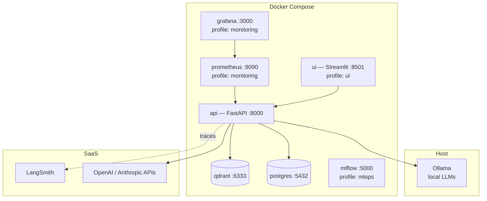
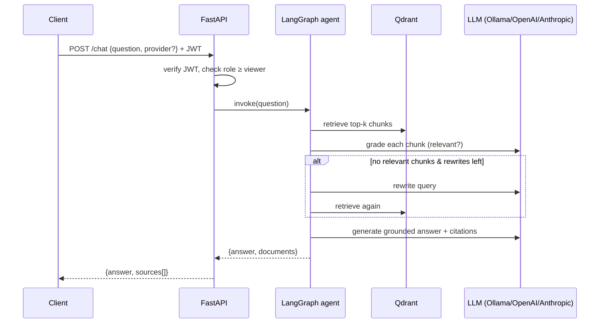
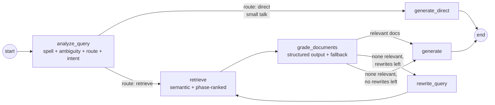

# Architecture — System Design

## 1. Context

Multi-user platform where authenticated users ingest documents and query them through an **agentic RAG pipeline**, with full observability, evaluation, fine-tuning, and drift monitoring around it. Design targets: **provider independence** (local ↔ API models), **security by default** (RBAC), **operability** (traces + metrics), **reproducibility** (config-driven, containerized).

## 2. Container view



The API reaches host Ollama via `host.docker.internal:11434`. Everything else is service-to-service on the compose network.

## 3. Request flow — `/api/v1/chat`



## 4. Agent graph (LangGraph)



CRAG-lite with pre-retrieval analysis (ADR-009): the analyzer fixes typos before
they poison retrieval, routes small talk past the pipeline, and flags superlative
phase questions for metadata-ranked retrieval. Conversation memory: a checkpointer
keyed by `conversation_id` carries recent turns for follow-up questions.

## 5. Data model (PostgreSQL)

| Table | Purpose | Key columns |
|---|---|---|
| `users` | auth + RBAC | id, email (unique), hashed_password (bcrypt), role, is_active |
| `documents` | ingestion registry + dedup | id, filename, content_hash (sha256), num_chunks, uploaded_by |
| `audit_log` | privileged-action trail | actor, action, resource, detail, created_at |
| `query_log` | drift-detection window | user_email, question, created_at |

Vector payloads in Qdrant carry `source`, `doc_id`, `chunk_index`, and `phase_number`
(range-indexed integer) for citation, filtered retrieval, and structural ranking
(ADR-009). Collections are created hybrid-capable (dense + BM25 sparse).

## 6. Security design

- **AuthN:** OAuth2 password flow → short-lived JWT (HS256). Password hashing: bcrypt.
- **AuthZ:** hierarchical RBAC enforced by FastAPI dependencies.

| Action | viewer | engineer | admin |
|---|---|---|---|
| `/chat`, list documents | ✅ | ✅ | ✅ |
| `/ingest` (write to vector DB) | ❌ | ✅ | ✅ |
| register users, manage roles | ❌ | ❌ | ✅ |

- Bootstrap: admin seeded from env on first startup; registration is admin-only after that.
- Implemented hardening: per-IP rate limiting on `/token` and `/chat` (slowapi, env-tunable), audit log on every privileged action (`GET /api/v1/admin/audit`), account disable (`is_active`) that preserves history, self-demotion guard, upload size limit + extension allowlist, CORS from env, non-root container user.
- Remaining backlog: external IdP (OIDC), token refresh/revocation, Redis-backed global rate limits, deeper prompt-injection defenses (context/instruction separation is in place via prompt design).

## 7. Observability design

| Signal | Tool | What it answers |
|---|---|---|
| Traces (SaaS) | **LangSmith** (env-enabled) | Why was this answer wrong/slow? Which node? What prompt? |
| Traces (self-hosted, ADR-011) | **OpenTelemetry** — Phoenix (OpenInference) or Jaeger (OpenLLMetry), `TRACING_BACKEND` | Same questions, but trace data never leaves your infra |
| Metrics | Prometheus (`/metrics`) → Grafana | Is the service healthy? RED: rate, errors, duration |
| Logs | structlog (JSON in prod) | Forensics, correlation via request context |

Implemented custom metrics (`core/metrics.py`): request counter per provider/outcome, agent latency histogram per provider, rewrite + correction counters, best-retrieval-score histogram (knowledge-base coverage signal). A Grafana dashboard is provisioned automatically; Prometheus alert rules cover API down, error rate > 5%, slow p95, and low retrieval scores (`monitoring/prometheus/alerts.yml`).

## 8. MLOps loop

```
ingest → serve (RAG) → collect traces/queries
   ↑                          ↓
register ← fine-tune ← curate dataset (from real usage)
   ↓
evaluate (RAGAS gate) → promote to serving (Ollama adapter)
                             ↓
                 monitor drift → trigger re-curation
```

MLflow tracks experiments and registers model versions; RAGAS scores gate promotion; drift jobs close the loop.

## 9. Deployment topology

- **Local dev:** `docker-compose.yml` with profiles; Ollama on host GPU.
- **Production VM:** `docker-compose.prod.yml` — Caddy terminates TLS (automatic Let's Encrypt) and is the only exposed service; API runs multi-worker as non-root with healthchecks; monitoring binds to localhost (SSH tunnel). See ADR-010.
- **Managed cloud:** Azure Container Apps / GCP Cloud Run + Qdrant Cloud + managed Postgres + Key Vault/Secret Manager — step-by-step in `infra/azure.md` and `infra/gcp.md`.
- **CD:** git tag `v*` → GitHub Actions builds/pushes GHCR images → optional cloud deploy + smoke test (`.github/workflows/cd.yml`).

## 10. Key trade-offs (details in ADRs)

- LangGraph over plain chains: explicit state machines are debuggable and extensible — worth the learning curve.
- Qdrant over Milvus/pgvector: best dev-experience + built-in dashboard; pgvector would cut a service but caps scale features.
- Per-chunk LLM grading adds laten